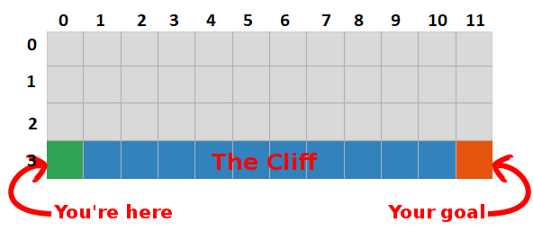

# Temporal Difference Learning Algorithms for Cliff Walking Environment

This is my implementation of the following three Temporal Difference (model-free) Learning Algorithms:

* Sarsamax (Q-learning)
* Sarsa-zero
* Expected Sarsa 

for Cliff Walking Environment using OpenAI gym's **cliff walking** environment.
OpenAI's main code for how the game environment works can be found [here](https://github.com/openai/gym/blob/master/gym/envs/toy_text/cliffwalking.py).

I used **epsilon-greedy method** to upgrade policy at each iteration.

## Repository 

This repository contains:
* **sarsa_x.py** :  Complete code for ALL steps of the 3 TD Learning algorithms' implementation
